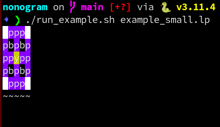

Nonogram constraint encoding in ASP
---

I implemented this years ago and am definitely not too proud of it.
Still, I could not find another encoding for them on the internet yet, so this can serve as a reference.

Utilizes the excellent Answer Set Solving suite [Potassco](https://potassco.org/).

Overview
---

- `run_example.sh`
    - look at this before doing anything else :)
- `nonogram.lp` actual ASP encoding
- `visualize_nonogram.py`
    - show ascii art for generated answer sets
- `nonogram_sw.sh`/`nonogram.sh`
    - simple scripts to write down nonogram problems from printed puzzles. Sorry for the horrible usability.
